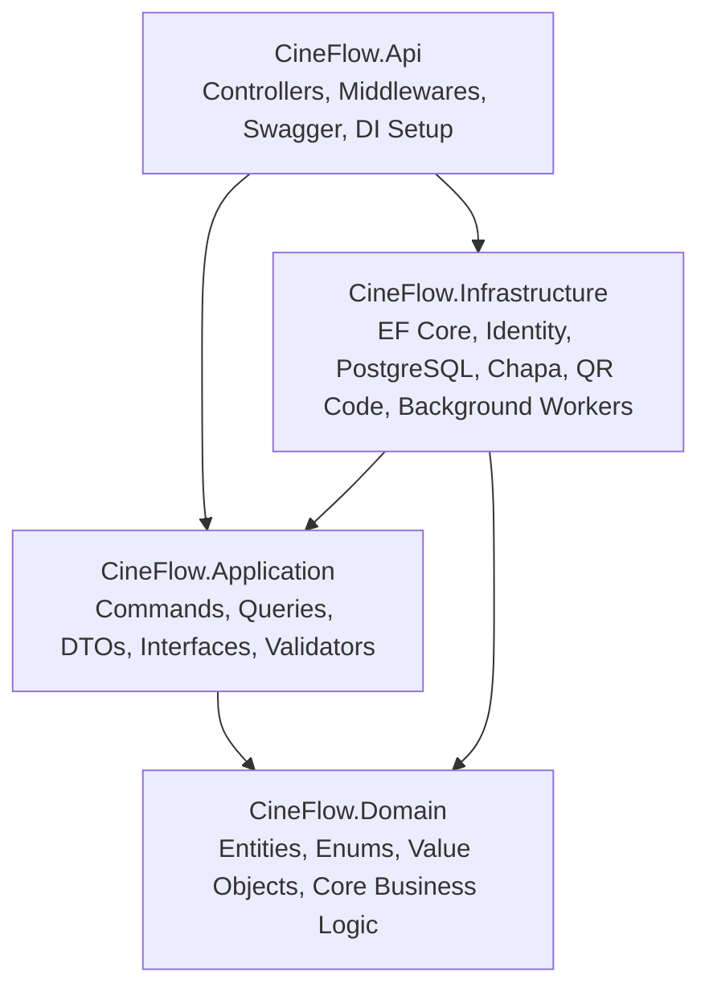

# 🎬 CineFlow API — Cinema Booking & Management System

[](https://dotnet.microsoft.com/)
[](https://learn.microsoft.com/aspnet/core)
[](https://www.npgsql.org/efcore/)
[](https://jwt.io/)
[](https://chapa.co/)
[](https://swagger.io/)

**CineFlow API** is an enterprise-grade cinema management and online movie ticket reservation backend built with **.NET 10**, **ASP.NET Core Web API**, and **Clean Architecture**. It features secure authentication, interactive seat reservations with automated expiration handling, seamless **Chapa** payment gateway integration, and digital QR-code ticket issuance.

---

## 🏗 Architecture Overview

CineFlow follows the principles of **Clean Architecture** and **Domain-Driven Design (DDD)**, dividing concerns into distinct layers:



- **`CineFlow.Domain`**: Core enterprise business logic and entities (`Movie`, `CinemaHall`, `Schedule`, `Ticket`, `SeatReservation`, `Director`, `Star`). Zero external dependencies.
- **`CineFlow.Application`**: Business rules, CQRS commands/queries, application service interfaces (`IPaymentService`, `IEncryptionService`), DTOs, and mapping logic.
- **`CineFlow.Infrastructure`**: Persistence layer using EF Core & PostgreSQL, ASP.NET Core Identity store, Chapa payment client, QR code generator, data encryption, and background cleanup workers.
- **`CineFlow.Api`**: Presentation layer containing RESTful controllers, JWT authentication filters, CORS policies, Swagger/OpenAPI configuration, and dependency injection wiring.

---

## ✨ Key Features

- **🔐 Authentication & Security**:
  - ASP.NET Core Identity with role-based access control (`Admin` vs `User`).
  - Secure JWT Bearer authentication tokens.
  - Account lockout protection against brute-force attacks.
  - AES payload encryption service for sensitive data transmission.

- **🎥 Movie & Catalog Management**:
  - Full CRUD operations for movies, genres, release dates, durations, and ratings.
  - Cast and crew tracking (Directors and Stars).
  - Local file storage integration for movie poster uploads and media assets.

- **🏛 Cinema Hall & Schedule Management**:
  - Hall layout configuration and capacity management.
  - Dynamic scheduling and screening showtimes linked to specific halls.

- **🎟 Real-Time Seat Reservation Engine**:
  - Interactive seat selection and reservation locking mechanism.
  - **Background Worker (`ExpiredReservationCleanupWorker`)**: Automatically detects and releases unconfirmed/unpaid seat reservations after timeout.

- **💳 Payment Gateway Integration (Chapa)**:
  - Integration with Chapa payment API for processing payments in Ethiopian Birr (ETB).
  - Webhook verification, payment status checks, and transaction callback handling.

- **📲 Digital Ticket & QR Code Issuance**:
  - Automatic digital ticket generation upon verified payment.
  - Built-in QR Code generation service for contactless gate verification.

- **📊 Admin Analytics & Dashboard**:
  - Real-time revenue metrics, ticket sales volume, screening statistics, and occupancy analytics.

---

## 🛠 Tech Stack

| Component | Technology / Library |
| :--- | :--- |
| **Framework** | .NET 10 / ASP.NET Core Web API |
| **Language** | C# 13 |
| **Architecture** | Clean Architecture / CQRS pattern |
| **ORM** | Entity Framework Core (Npgsql PostgreSQL Provider) |
| **Database** | PostgreSQL |
| **Authentication** | ASP.NET Core Identity + JWT Bearer Tokens |
| **Payment Gateway** | Chapa API |
| **Background Processing** | `IHostedService` Background Workers |
| **Documentation** | Swagger / OpenAPI with JWT Bearer support |
| **Utilities** | QRCoder (QR generation), BCrypt / AES (Security) |

---

## 📁 Solution Structure

```
CineFlow/
├── CineFlow.Api/                    # API Entry point & REST controllers
│   ├── Controllers/                 # Admin, Auth, CinemaHall, Movies, Payment, Schedule, Tickets
│   ├── appsettings.json             # Configuration (DB, JWT, Chapa, Encryption)
│   └── Program.cs                   # Application pipeline & DI container
├── CineFlow.Application/            # Application business logic layer
│   ├── Common/                      # Interfaces, exceptions, helpers
│   ├── Configuration/               # Options classes (ChapaOptions, EncryptionOptions)
│   ├── Interfaces/                  # IPaymentService, IEncryptionService, etc.
│   ├── Movies/                      # Movie commands, queries & handlers
│   └── Schedules/                   # Schedule commands, queries & handlers
├── CineFlow.Domain/                 # Enterprise domain models
│   └── Entities/                    # Movie, CinemaHall, Schedule, Ticket, SeatReservation, etc.
├── CineFlow.Infrastructure/         # External integrations & persistence
│   ├── Persistence/                 # EF Core DbContext, entity configurations, migrations
│   ├── Payments/                    # Chapa payment gateway implementation
│   ├── Security/                    # AES encryption and token utilities
│   ├── Services/                    # QR code generator, file storage, background workers
│   └── DependencyInjection.cs       # Infrastructure service registrations
└── CineFlow.slnx                    # Solution file
```

---

## 🚀 Getting Started

### Prerequisites

Ensure you have the following installed on your machine:
- [.NET 10.0 SDK](https://dotnet.microsoft.com/download)
- [PostgreSQL Database Server](https://www.postgresql.org/)
- [Git](https://git-scm.com/)

### 1. Clone the Repository

```bash
git clone https://github.com/Nahom2231/CineFlow.git
cd CineFlow
```

### 2. Configure `appsettings.json`

Create or update `CineFlow.Api/appsettings.json` (or `appsettings.Development.json`):

```json
{
  "ConnectionStrings": {
    "DefaultConnection": "Host=localhost;Port=5432;Database=CineFlowDb;Username=postgres;Password=your_password;"
  },
  "JwtSettings": {
    "Secret": "YourSuperSecretJWTKeyWithAtLeast32CharactersLong!",
    "Issuer": "CineFlowApi",
    "Audience": "CineFlowClient",
    "ExpiryInMinutes": 120
  },
  "ChapaOptions": {
    "SecretKey": "CHASECK_TEST-xxxxxxxxxxxxxxxxxxxx",
    "BaseUrl": "https://api.chapa.co/v1/"
  },
  "EncryptionOptions": {
    "Key": "your-32-character-encryption-key!",
    "IV": "your-16-byte-iv!"
  },
  "Logging": {
    "LogLevel": {
      "Default": "Information",
      "Microsoft.AspNetCore": "Warning"
    }
  }
}
```

### 3. Run Database Migrations

Apply Entity Framework Core migrations to your PostgreSQL database:

```bash
dotnet ef database update --project CineFlow.Infrastructure --startup-project CineFlow.Api
```

### 4. Run the Application

```bash
dotnet run --project CineFlow.Api
```

Once running, access Swagger API documentation at:
- **Swagger UI**: `http://localhost:5000/swagger` or `https://localhost:5001/swagger`

---

## 📡 API Endpoints Overview

| Controller | Route | Description | Auth Required |
| :--- | :--- | :--- | :---: |
| **Auth** | `POST /api/auth/register` | Register a new customer account | No |
| **Auth** | `POST /api/auth/login` | Authenticate user & receive JWT token | No |
| **Movies** | `GET /api/movies` | Get all currently showing & upcoming movies | No |
| **Movies** | `GET /api/movies/{id}` | Get detailed movie metadata and cast | No |
| **Movies** | `POST /api/movies` | Add a new movie (with poster upload) | Admin |
| **Cinema Halls** | `GET /api/cinemahall` | Retrieve all cinema halls and seat layouts | No |
| **Schedules** | `GET /api/schedule` | Retrieve movie screening schedules | No |
| **Schedules** | `POST /api/schedule` | Schedule a new screening time | Admin |
| **Payments** | `POST /api/payment/initialize` | Initialize Chapa checkout for reserved seats | User |
| **Payments** | `GET /api/payment/verify/{txRef}` | Verify transaction status with Chapa | User |
| **Tickets** | `GET /api/tickets/my-tickets` | List user's booked tickets | User |
| **Tickets** | `GET /api/tickets/{id}/qr` | Retrieve ticket verification QR code | User |
| **Admin** | `GET /api/admin/dashboard` | Fetch platform revenue, bookings & analytics | Admin |

---

## 🔒 Security Best Practices

- **Token Protection**: JWTs are signed with HMAC-SHA256 and verified for issuer, audience, and lifetime.
- **Sensitive Fields**: Sensitive payload fields are encrypted using AES before transit.
- **CORS Configured**: CORS policies restrict API access to trusted frontend origins (Angular, React, Vue).
- **Seat Race Condition Prevention**: Background lock & transactional reservation prevent double booking.

---

## 👨‍💻 Author

- **Nahom** — [@Nahom2231](https://github.com/Nahom2231)

---

## 📄 License

This project is licensed under the MIT License - see the [LICENSE](LICENSE) file for details.
